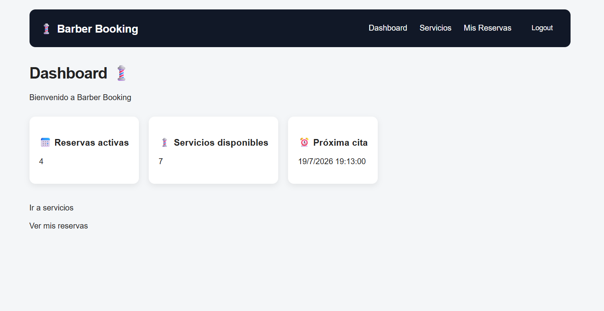
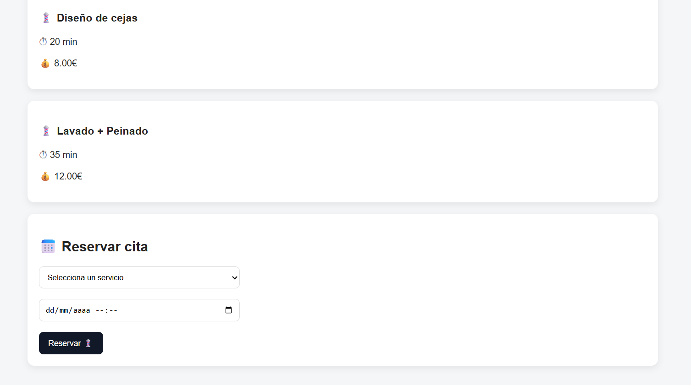
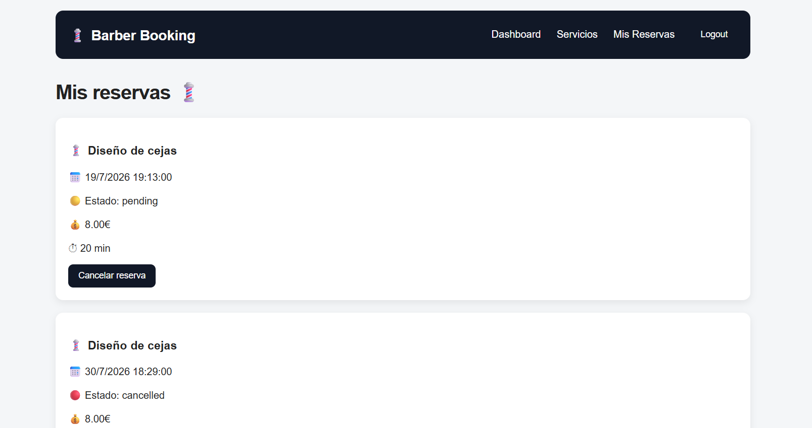

#  Barber Booking

A modern Full Stack web application for managing barbershop appointments.

This project allows users to register, log in securely, browse available services, book appointments, and manage their own reservations.

---

##  Live Demo

**Frontend:** https://booking-barber-8789.vercel.app/

---

##  Screenshots

### Login


### Register


### Dashboard



### Services



### My Bookings



---

##  Features

*  User authentication with JWT
*  User registration and login
*  Browse barbershop services
*  Book appointments
*  Cancel bookings
*  Protected routes
*  Responsive interface
*  Backend deployed on Render
*  Frontend deployed on Vercel

---

##  Tech Stack

### Frontend

* React
* Vite
* React Router
* Axios
* CSS

### Backend

* Node.js
* Express
* PostgreSQL
* JWT (JSON Web Tokens)
* bcrypt

### Deployment

* Vercel
* Render

---

##  Project Structure

```text
projectBarberSaasMarc
│
├── frontend
│   ├── src
│   ├── public
│   └── package.json
│
├── backend
│   ├── src
│   ├── routes
│   ├── middleware
│   └── package.json
│
└── README.md
```

---

##  Installation

### Clone the repository

```bash
git clone https://github.com/MarcG1922/booking-barber.git
```

### Backend

```bash
cd backend
npm install
npm run dev
```

### Frontend

```bash
cd frontend
npm install
npm run dev
```


##  What I learned

During this project I practiced:

* Building REST APIs with Express
* Authentication using JWT
* PostgreSQL database management
* React state management
* Route protection
* API integration with Axios
* Full Stack deployment
* Git and GitHub workflow

---

##  Future Improvements

* Administrator panel
* Appointment calendar
* Email notifications
* User profile
* Online payments
* Service management
* Barber availability

---

##  Author

**Marc Granero**

Junior Full Stack Developer

GitHub: https://github.com/MarcG1922

LinkedIn: www.linkedin.com/in/marc-granero

---
